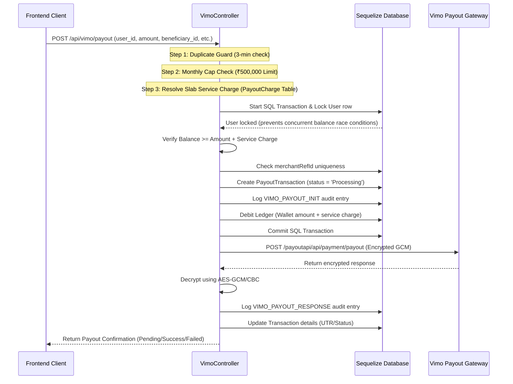

# Vimo Payout Integration & Flow Guide

This document describes the complete API flow, cryptographic framework, database transaction logic, and webhook handling for the **Vimo Payout** service. It also provides guidance and templates for integrating Vimo into other areas of the system (such as cron jobs, alternative controllers, and the frontend).

---

## 1. Key Files & Repository Map

- **Routing Layer**: [vimoRoutes.js](file:///d:/AbheePay/POS-SERVER/routes/vimoRoutes.js)
  - Exposes client and webhook endpoints. Enforces authentication via JWT, roles, and employee permission checks.
- **Controller Layer**: [vimoController.js](file:///d:/AbheePay/POS-SERVER/controllers/vimoController.js)
  - Manages request validation, concurrency locks, ledger debit/refund queries, callback hooks, and manual admin recovery.
- **Service Layer (Provider API)**: [vimo.service.js](file:///d:/AbheePay/POS-SERVER/services/vimo.service.js)
  - Manages cryptographic operations (AES-GCM encryption, decryption contexts, decompression), dynamic auth tokens, and outgoing HTTP requests.
- **Penny Drop Validator**: [instantpayService.js](file:///d:/AbheePay/POS-SERVER/services/payments/instantpayService.js)
  - Verifies the beneficiary's bank account prior to saving/activating registration.

---

## 2. Core API Workflow

### Phase A: Authentication & Token Cache
Vimo requires a bearer token generated dynamically using API keys.
1. **Endpoint Called**: `/payoutapi/api/signature/authorize`
2. **Required Headers**: `secretKey`, `saltKey`, `encryptdecryptKey`, `userId` from environment variables.
3. **Caching**: The backend caches the token in `tokenCache` for up to 10 minutes (`VIMO_TOKEN_TTL_MS`).
4. **Fallback**: If the token expires or returns `401 Unauthorized`, the backend automatically calls `fetchFreshToken` and retries.

### Phase B: Cryptography System
Vimo payloads must be encrypted during transit:
- **Encryption**: Payload is stringified, encrypted using **AES-GCM** (with `VIMO_ENCRYPTDECRYPT_KEY` and `VIMO_SALT_KEY` as IV). The 16-byte auth tag is appended to the ciphertext, which is then base64-encoded and sent under the `requestBody` property:
  ```json
  {
    "requestBody": "BASE64_STRING_HERE..."
  }
  ```
- **Decryption**: Inbound responses are decrypted by attempting GCM first, and falling back to **AES-CBC** if the auth tag fails.
- **Decompression**: If the decrypted buffer contains zipped data, it is decompressed using GZIP (with raw inflate/unzip fallbacks).
- **Context Candidates**: If decryption fails using default settings, the service sequentially iterates through candidate configurations (different encodings like hex vs. UTF-8, and IV lengths) to ensure robust processing.

---

## 3. Step-by-Step Payout Initiation Flow



### Detailed Validation & Safeguard Logic
1. **3-Minute Duplicate Guard**: Rejects payouts of the same amount to the same user/beneficiary within 3 minutes (if previous transaction is non-failed). Returns `429 Too Many Requests`.
2. **Monthly Limit Safeguard**: Checks total non-failed payouts (SUCCESS/PENDING) for the target bank account in the current calendar month.
   - **Local Check**: Searches the database globally across all users sending to that bank account number.
   - **Partner PG Check**: Requests `/api/vimo/payout/limit-check` from Partner PG to sum external transactions.
   - **Enforcement**: If `Total + Current Amount > ₹500,000`, the transaction is blocked (returns `400 Bad Request`).
3. **Service Charge slabs**: Reads active rules in `PayoutCharge` table based on the amount range. Falls back to `VIMO_DEFAULT_SERVICE_CHARGE` env configuration.
4. **Ledger Debit**: Wallet is debited for the full amount (`amount + service_charge`) synchronously before dispatching the request to the provider.

---

## 4. Webhook callback & Status Checks

### Webhook / Callback Handler (`POST /api/vimo/callback`)
- **Fast Response**: Immediately saves the raw payload to `PayoutWebhookLog` and returns `200 Success` (responseCode `000`) to avoid webhook retries.
- **Background Processing (`setImmediate`)**:
  1. Checks if the transaction is already in a terminal state (`SUCCESS`, `FAILED`, `REVERSED`, `CANCELLED`). If yes, it skips execution to avoid double processing.
  2. Maps Vimo status to internal state:
     - `SUCCESS` / `TRANSFERRED` $\rightarrow$ `SUCCESS`
     - `FAILED` / `FAILURE` / `REJECTED` / `REVERSED` / `CANCELLED` $\rightarrow$ `FAILED`
  3. Updates transaction status, UTR, and callback logs in the database.
  4. **Refund Processing**: If transaction transitioned to `FAILED`, checks if `payout_refund` entry exists in the `Ledger` table. If none exists, credits back the total amount (`amount + service_charge`) to the merchant's wallet.
  5. **BillAvenue Payment linkage**: If the payout was initiated as a Credit Card bill payment, it updates the associated `BillAvenuePayment` state automatically.

### Status Query (`POST /api/vimo/payout/status`)
- Querying status uses the `checkPayoutStatus` API.
- > [!IMPORTANT]
  > Unlike payout creation payloads, the status check API expects the **raw string value** of the ID (`merchantRefId` or `txnId`) rather than a JSON object. This raw string is encrypted directly and wrapped in the `requestBody` envelope.
- Updates the database transaction to `SUCCESS` if it was previously `PENDING` and the provider response status is `SUCCESS`.

---

## 5. Master Data & Callback Payload Formats

This section outlines the exact formats of the master data APIs, balance checks, and the callback webhooks returned to/from Vimo.

### 1) Fetch Bank List (`GET /api/vimo/banks`)
Used to resolve bank codes for beneficiary registration.
* **Provider URL**: `/masterapi/api/master/banklist`
* **Response format**:
  ```json
  {
    "success": true,
    "message": "Bank list fetched successfully",
    "responseCode": "000",
    "data": [
      {
        "code": "1",
        "description": "State Bank of India"
      },
      {
        "code": "2",
        "description": "ICICI Bank"
      },
      {
        "code": "3",
        "description": "HDFC Bank"
      }
    ]
  }
  ```

### 2) Fetch Purpose List (`GET /api/vimo/purposes`)
Used to fetch supported payment purpose codes (must be 2-10 characters, alphanumeric).
* **Provider URL**: `/masterapi/api/master/purposelist`
* **Response format**:
  ```json
  {
    "success": true,
    "message": "Purpose list fetched successfully",
    "responseCode": "000",
    "data": [
      {
        "code": "MERCHANT_PAYOUT",
        "description": "Merchant Payout"
      },
      {
        "code": "SALARY",
        "description": "Salary Transfer"
      }
    ]
  }
  ```

### 3) Fetch State List (`GET /api/vimo/states`)
Used to fetch alphanumeric state codes required during beneficiary addition.
* **Provider URL**: `/masterapi/api/master/statelist`
* **Response format**:
  ```json
  {
    "success": true,
    "message": "State list fetched successfully",
    "responseCode": "000",
    "data": [
      {
        "code": "DL",
        "description": "Delhi"
      },
      {
        "code": "JH",
        "description": "Jharkhand"
      },
      {
        "code": "MH",
        "description": "Maharashtra"
      }
    ]
  }
  ```

### 4) Wallet Balance Check (`GET /api/vimo/balance`)
Retrieves the current provider wallet balance.
* **Provider URL Candidates**: `/gateway/api/payment/getwalletDetail`, `/payoutapi/api/payment/getwalletDetail`
* **Response format**:
  ```json
  {
    "success": true,
    "message": "Wallet detail fetched successfully",
    "merchantRefId": "APV0000030664",
    "data": {
      "availableBalance": 60397.35
    }
  }
  ```

### 5) Webhook Payout Callback Format (`POST /api/vimo/callback`)
This payload is posted asynchronously by Vimo's webhook to notify status updates.
* **Payload Format (JSON)**:
  ```json
  {
    "merchantRefId": "APPV00000001",
    "txnStatus": "SUCCESS",
    "utr": "UTRN1234567890",
    "amount": 1000.00,
    "charges": 10.00,
    "responseCode": "000",
    "responseMessage": "Transaction successful",
    "txnId": "TXN_VIMO_12345",
    "beneficiaryAccountNumber": "1234567890",
    "beneficiaryIFSC": "SBIN0000001"
  }
  ```
  *(Note: Vimo status mapping keys are handled dynamically: `merchantRefId` can also map from `merchant_ref_id` or `referenceId`; `txnStatus` can map from `status`; `utr` can map from `bankRefNo`).*

---

## 6. Integrating Vimo Elsewhere

If you need to add Vimo to other areas of the system, here are the three primary integration patterns:

### Pattern 1: Automatic Pending Payout Resolver (Cron Job)
To automatically resolve payouts stuck in a `PENDING` status, you can create a cron file like `cron/resolvePendingVimo.js`. Here is the complete template for it:

```javascript
const fs = require('fs');
const path = require('path');
const cron = require('node-cron');
const { Op } = require('sequelize');
const PayoutTransaction = require('../models/PayoutTransaction');
const Ledger = require('../models/Ledger');
const PayoutAuditLog = require('../models/PayoutAuditLog');
const vimoService = require('../services/vimo.service');
const db = require('../config/database');
const ledgerService = require('../services/ledgerService');

const LOG_FILE = path.resolve(__dirname, '../logs/vimo-payout-cron.log');
if (!fs.existsSync(path.dirname(LOG_FILE))) {
  fs.mkdirSync(path.dirname(LOG_FILE), { recursive: true });
}

const THREE_MINUTES_MS = 3 * 60 * 1000;
const FIVE_MINUTES_MS = 5 * 60 * 1000;
let cronInFlight = false;

function writeLog(message) {
  const ts = new Date().toISOString();
  fs.appendFileSync(LOG_FILE, `[${ts}] ${message}\n`);
}

async function resolvePendingVimoPayouts() {
  if (cronInFlight) return;
  cronInFlight = true;

  try {
    const cutoff = new Date(Date.now() - THREE_MINUTES_MS);
    const pendingTxns = await PayoutTransaction.findAll({
      where: {
        status: 'PENDING',
        payout_provider: 'Vimo',
        createdAt: { [Op.lt]: cutoff }
      }
    });

    for (const tx of pendingTxns) {
      // Limit check updates to once every 5 minutes
      const lastUpdated = new Date(tx.updatedAt || tx.createdAt).getTime();
      if (Date.now() - lastUpdated < FIVE_MINUTES_MS) continue;

      try {
        writeLog(`Checking status for Vimo Payout ID: ${tx.id}, Ref: ${tx.reference_id}`);
        
        // Call Vimo status check
        const response = await vimoService.checkPayoutStatus({ merchantRefId: tx.reference_id });
        const providerData = response.data;
        const providerStatus = (providerData?.txnStatus || '').toUpperCase();

        const tr = await db.transaction();
        try {
          const lockedTx = await PayoutTransaction.findByPk(tx.id, { transaction: tr, lock: tr.LOCK.UPDATE });
          
          if (!lockedTx || ['SUCCESS', 'FAILED', 'REVERSED'].includes(lockedTx.status)) {
            await tr.commit();
            continue;
          }

          if (providerStatus === 'SUCCESS') {
            lockedTx.status = 'SUCCESS';
            await lockedTx.save({ transaction: tr });

            await PayoutAuditLog.create({
              payout_id: lockedTx.id,
              action: 'VIMO_CRON_RESOLVED_SUCCESS',
              details: { status: 'SUCCESS', response: response.data }
            }, { transaction: tr });

            writeLog(`Payout ${tx.reference_id} marked SUCCESS`);
          } else if (['FAILED', 'FAILURE', 'REJECTED', 'REVERSED'].includes(providerStatus)) {
            lockedTx.status = 'FAILED';
            await lockedTx.save({ transaction: tr });

            const refundAmount = parseFloat(lockedTx.amount || 0) + parseFloat(lockedTx.service_charge || 0);
            
            // Validate that refund ledger doesn't already exist
            const existingRefund = await Ledger.findOne({
              where: {
                transaction_type: 'payout_refund',
                reference_id: lockedTx.id,
                reference_table: 'PayoutTransactions'
              },
              transaction: tr
            });

            if (!existingRefund && refundAmount > 0) {
              await ledgerService.createLedgerEntry({
                userId: lockedTx.merchant_id,
                transactionType: 'payout_refund',
                referenceId: lockedTx.id,
                referenceTable: 'PayoutTransactions',
                description: `Refund for failed Vimo payout ${lockedTx.reference_id} (Cron)`,
                credit: refundAmount,
              }, { transaction: tr });
            }

            await PayoutAuditLog.create({
              payout_id: lockedTx.id,
              action: 'VIMO_CRON_RESOLVED_FAILED',
              details: { status: 'FAILED', refundAmount, response: response.data }
            }, { transaction: tr });

            writeLog(`Payout ${tx.reference_id} marked FAILED, refund issued`);
          } else {
            // Keep pending and touch timestamp
            lockedTx.changed('updatedAt', true);
            await lockedTx.save({ transaction: tr });
            writeLog(`Payout ${tx.reference_id} still pending: ${providerStatus}`);
          }

          await tr.commit();
        } catch (err) {
          await tr.rollback();
          writeLog(`Transaction failed for payout ID ${tx.id}: ${err.message}`);
        }
      } catch (err) {
        writeLog(`Status API call failed for ref ${tx.reference_id}: ${err.message}`);
      }
    }
  } finally {
    cronInFlight = false;
  }
}

// Run every 1 minute
cron.schedule('0 */1 * * * *', () => {
  resolvePendingVimoPayouts().catch(err => console.error('Vimo cron error:', err));
});
```

### Pattern 2: Importing Vimo Service in Other Backend Modules
If you want to invoke Vimo payout actions from another router or service (e.g. dynamic routing based on smart provider selector algorithms), you can import the service:

```javascript
const vimoService = require('../services/vimo.service');

// Example: Triggering a payout check manually
const checkResult = await vimoService.checkPayoutStatus({ merchantRefId: 'APPV12345678' });
console.log('Status Code:', checkResult.responseCode);
console.log('Txn Status:', checkResult.data.txnStatus);

// Example: Querying raw wallet balance
const balanceResult = await vimoService.fetchWalletBalance('APPV_BALANCE_REF');
console.log('Wallet Balance:', balanceResult.data.balance);
```

### Pattern 3: Integrating in Frontend / UI Pages
To allow users to select Vimo Payout in alternative payout screens on the POS client:
1. **Permissions check**: Verify the authenticated user has `vimo_payout` flag set to `true` in `is_payout_enabled` or settings payload.
2. **Fetch reference**: Always execute `GET /api/vimo/payout/reference` first. Use this `merchantRefId` as an idempotency key.
3. **Register Vimo-compatible Beneficiary**:
   - Collect the **state code** of the beneficiary (e.g. `JH` or `DL`). Vimo requires `state` to be supplied.
   - Use `POST /api/vimo/beneficiaries` to register.
4. **TPIN and Coordinates**:
   - Vimo requires coordinates. Capture the user browser geolocation:
     ```javascript
     navigator.geolocation.getCurrentPosition((position) => {
       const lat = position.coords.latitude;
       const long = position.coords.longitude;
       // Include these inside POST /api/vimo/payout
     });
     ```
5. **Handle duplicates**: If the backend returns `409 DUPLICATE_REFERENCE`, fetch a new `merchantRefId` and retry.
