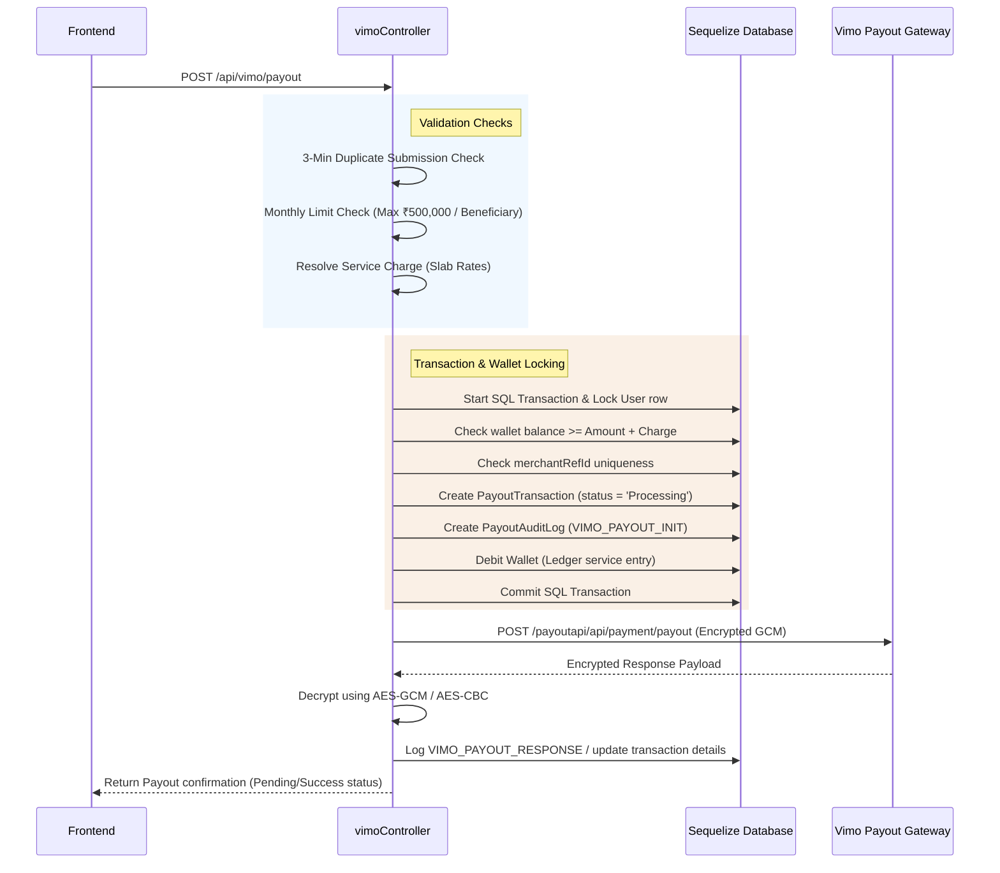

# Vimo Payout Integration & Flow Documentation

This document describes the complete flow, API details, and logic implemented in the backend for the **Vimo Payout** service.

---

## 1. Directory Structure & Key Files
- **Service Layer**: [vimo.service.js](file:///d:/AbheePay/POS-SERVER/services/vimo.service.js) — Encryption, decryption, token authorization cache, and outgoing API requests to the Vimo bank provider.
- **Controller Layer**: [vimoController.js](file:///d:/AbheePay/POS-SERVER/controllers/vimoController.js) — Request validation, ledger debiting, concurrency locks, duplicate checks, callback processing, and manual admin recovery.
- **Routing Layer**: [vimoRoutes.js](file:///d:/AbheePay/POS-SERVER/routes/vimoRoutes.js) — Exposes API endpoints for the client and webhook callbacks.

---

## 2. Base Configuration & Authentication
All endpoints (except the public webhook callback) require authentication via `Authorization: Bearer <token>`.

### Authentication/Token Generation
Vimo requires a bearer token generated via dynamic signature authorization.
* **Internal route**: `GET` / `POST` `/api/vimo/auth/token`
* **Provider endpoint**: `/payoutapi/api/signature/authorize`
* **Headers sent to provider**:
  ```http
  secretKey: <VIMO_SECRET_KEY>
  saltKey: <VIMO_SALT_KEY>
  encryptdecryptKey: <VIMO_ENCRYPTDECRYPT_KEY>
  userId: <VIMO_USER_ID>
  ```
* **Internal Behavior**: The backend caches this token (`tokenCache`) for up to 10 minutes (configurable via `VIMO_TOKEN_TTL_MS`). If the cache is expired or the provider returns a `401 Unauthorized` response, a fresh token is fetched automatically.

---

## 3. Beneficiary Management
Before initiating a payout, a merchant must register and verify a beneficiary.

### Add Beneficiary
* **Endpoint**: `POST /api/vimo/beneficiaries`
* **Request Payload**:
  ```json
  {
    "name": "John Doe",
    "account_number": "1234567890",
    "ifsc_code": "SBIN0000001",
    "bank_name": "State Bank of India",
    "bank_code": "9999",
    "branch_name": "Main Branch",
    "state": "DL",
    "mobile": "9876543210",
    "email": "johndoe@example.com"
  }
  ```
* **Under-the-Hood Flow**:
  1. **Bank Account Validation**: Calls the `instantpayService.verifyBankAccount` (Penny Drop) API to verify details first.
  2. **Penny Drop Fee**: Automatically charges ₹1 to the user's wallet as a penny drop ledger verification fee.
  3. **Verification Check**: If the validation status is `FAILED`, the request is rejected with a `400 Bad Request`. If successful, the verified name from the bank is saved.
  4. **Database Persist**: Checks if a beneficiary with the same account number/IFSC already exists for the merchant. If so, updates it and sets the status to `active`; otherwise, creates a new record.

### Other Beneficiary Endpoints
* **List Active Beneficiaries**: `GET /api/vimo/beneficiaries`
* **Update Beneficiary**: `PUT /api/vimo/beneficiaries/:id`
* **Delete Beneficiary (Soft Delete)**: `DELETE /api/vimo/beneficiaries/:id` (Sets status to `inactive`).

---

## 4. Payout Initiation Flow
Initiates a fund transfer from the merchant's POS-SERVER wallet to the beneficiary bank account.

### Create Payout Request
* **Endpoint**: `POST /api/vimo/payout`
* **Payload**:
  ```json
  {
    "user_id": 2,
    "amount": 1000.00,
    "beneficiary_id": 14,
    "paymentPurpose": "MERCHANT_PAYOUT",
    "paymentMode": "IMPS",
    "lat": "28.6139",
    "long": "77.2090",
    "merchantRefId": "MV-123456" 
  }
  ```
  *(Note: If `beneficiary_id` is supplied, the account, IFSC, and state location are auto-resolved from the DB. Alternatively, they can be sent raw).*

### Step-by-Step Backend Execution


1. **3-Minute Duplicate Guard**: Prevents accidental double clicks. Checks for any active non-failed payouts with the same user, amount, and beneficiary within the last 3 minutes.
2. **Monthly Cap Check**: Checks total non-failed payouts for this beneficiary in the current month. Maximum limit is **₹500,000**.
3. **Service Charge Resolution**: Queries `PayoutCharge` table for active slab rules based on the payout amount. If none exist, falls back to `VIMO_DEFAULT_SERVICE_CHARGE` env variable.
4. **Concurrency Safety & Balance Deduct (SQL Transaction)**:
   - Locks the user row (`transaction.LOCK.UPDATE`) to serialise balance checks and avoid race conditions.
   - Verifies if the merchant's balance is sufficient for `Amount + Service Charge`.
   - Deducts the full amount from the ledger wallet and creates a `PayoutTransaction` with status `Processing`.
5. **API Dispatch**: Payload is JSON-stringified, encrypted via `AES-GCM` (using `VIMO_ENCRYPTDECRYPT_KEY` and `VIMO_SALT_KEY` as IV), and posted to Vimo.
6. **Response Decryption**: Decrypts the response envelope using AES-GCM (fallback to AES-CBC / gzip decompress). The transaction fields are updated, and the user receives a confirmation.

---

## 5. Payout Status Check
A merchant or cron job can fetch the latest transaction status from Vimo.
* **Endpoint**: `GET` / `POST` `/api/vimo/payout/status`
* **Query/Body Params**: `merchantRefId` or `txnId`
* **Internal Behavior**:
  1. Calls Vimo `/payoutapi/api/payment/payoutstatuscheck`.
  2. The input `merchantRefId` or `txnId` is encrypted as plain text and sent.
  3. Decrypts response payload and writes debugging logs to `logs/vimoStatusCheck.log`.

---

## 6. Webhook / Callback Handler
Vimo calls this endpoint to notify the server of status updates asynchronously.
* **Endpoint**: `POST /api/vimo/callback` (Public)

### Processing Logic
1. **Auditing**: Raw payload is immediately persisted to `PayoutWebhookLog`.
2. **Fast Response**: Responds `200 Success` (responseCode `000`) immediately to Vimo to prevent duplicate webhook retries.
3. **Background Job**: Processing is queued immediately using `setImmediate`:
   - Checks if the transaction is already in a terminal state (`SUCCESS`, `FAILED`, `REVERSED`, `CANCELLED`). If so, **skips** processing to avoid duplicate updates.
   - Maps status:
     - `SUCCESS` / `TRANSFERRED` $\rightarrow$ `SUCCESS`
     - `FAILED` / `FAILURE` / `REJECTED` / `REVERSED` / `CANCELLED` $\rightarrow$ `FAILED`
   - Updates `PayoutTransaction` state, UTR, and callback receipt details.
   - **Refund Logic**: If marked `FAILED`, checks if a refund has already been credited to the ledger. If not, creates a credit ledger entry (`payout_refund`) returning the principal amount + service charge back to the merchant's wallet.

---

## 7. Manual Recovery (Admin override)
If a payout gets stuck in `Processing` due to network loss or missing callbacks, admins can manually mark it failed.
* **Endpoint**: `POST /api/vimo/payout/admin/fail` (Requires `PAYOUT_MANAGE` permission)
* **Rule**: Payout must have been stuck in `Processing` for **at least 10 minutes**.
* **Effect**: Marks transaction as `FAILED`, updates callback status, and credits the principal + service charge back to the merchant's wallet.
